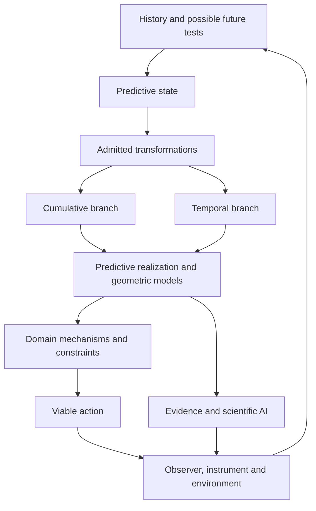

# The Empirical Architecture

[](https://empirical-observatory.madmanmuzza.chatgpt.site/projects)

**[Browse current projects on GitHub](CURRENT_PROJECTS.md) · [Run the live Observatory](https://empirical-observatory.madmanmuzza.chatgpt.site)**

**New: [Research Atlas — explore the whole programme](https://empirical-observatory.madmanmuzza.chatgpt.site/atlas).** Rotate a perspective map of the research lines, inspect their evidence and next tests, and run an experiment whose next question changes with its observations. The adaptive loop is implemented in a declared simulation; learning a better policy across projects remains a future test. [Architecture, independent review and reproducible results](https://github.com/thantiklermcirony/empirical-observatory/blob/main/public/research/observatory-evolution/README.md).

**Flagship: [Virtual Cell — two completed experiments](https://empirical-observatory.madmanmuzza.chatgpt.site/cell#flight02).** The first flight tested four held-out cell contexts. Flight 02 tested 50 cell lines and 92 exact drug/dose identities, with code frozen and published before decoding the response values. Its added control-profile information reduced retained error by only **0.13%**, missing the declared **10%** threshold and winning against each fold's best comparison in **one of five** folds. Both candidates failed their declared success gates. [Explore the interactive results](https://empirical-observatory.madmanmuzza.chatgpt.site/cell#flight02) · [Frozen code, original predictions and independent review](https://github.com/thantiklermcirony/empirical-observatory/tree/main/research/virtual-cell-flight02).

**Latest contribution: [Ray Serve controller recovery — PR #66039](https://github.com/ray-project/ray/pull/66039).** In a real Linux HTTP experiment, the original returned the wrong application in all 60 probes; the candidate returned the new application in all 60. Thirty selected Linux tests and the source checks pass, with 16 recovery and shutdown checks also passing on Windows. One CPU node was tested. Submitted after human review and local tests; awaiting maintainer review. [Evidence and limits](https://github.com/thantiklermcirony/empirical-architecture/blob/main/research/ray-campaign/Ray_Contribution_Report.md).

**Also submitted: [NeuroGym decision cue — PR #295](https://github.com/neurogym/neurogym/pull/295).** A task could require different answers after identical visible histories. Our proposed correction makes its intended action window observable. All 132 candidate-suite tests pass on the tested Windows/Python 3.12 runtime; 240 seeded trials preserve all other observation channels, targets and timings. [Results and reproduction](https://github.com/thantiklermcirony/empirical-observatory/blob/main/public/research/NeuroGym_Contribution_Report.md). Submitted for maintainer review; not merged.

Earlier contributions: [Pertpy biological evaluator](https://github.com/scverse/pertpy/pull/1098), [Graphiti history](https://github.com/getzep/graphiti/pull/1867) and [Graphiti timestamps](https://github.com/getzep/graphiti/pull/1866). All remain submitted for review. [Next three contribution investigations](https://github.com/thantiklermcirony/empirical-observatory/blob/main/public/research/Next_Big_Three.md).

### A minimal architecture for science, life and intelligence

**We are building common mathematical and computational foundations for how science represents reality, discovers laws and turns knowledge into action.**

The programme asks what makes a scientific description adequate: what it must remember, which transformations it can represent, what its observations conceal, and which futures remain accessible to an observer. Its ambition is a change in how scientific models and intelligent systems are built.

[Read the manifesto](MANIFESTO.md) · [Explore the programme](research/PROGRAMME.md) · [Browse 41 manuscripts](corpus/README.md) · [See the research roadmap](ROADMAP.md) · [Contribute](CONTRIBUTING.md)

## Enter the Empirical Observatory

The [living Observatory architecture](https://github.com/thantiklermcirony/empirical-observatory/blob/main/public/research/observatory-evolution/Architecture.md) keeps evidence and experiment contracts traceable while allowing models, representations and even the central framing to change through explicit versions. Its second biology experiment is complete: the separate Tahoe chemical plate supplied 4,443 observed cell-line/treatment pairs and 2,000 released genes. The candidate failed its superiority gate; original predictions, retained subsets, input-scale limitations and independent checks are public. [Read the result](https://github.com/thantiklermcirony/empirical-observatory/blob/main/research/virtual-cell-flight02/RESULTS.md).

The programme now has a [playable, open-source research station](https://github.com/thantiklermcirony/empirical-observatory): TAO control experiments, quantum measurement, local behaviour and an instrument dock, plus Earth, AI and Genome expeditions.

Release 0.2 adds real Oslo observation capture and replay, an executed POPGym memory diagnostic, an AlphaGenome Atlas adapter and an optional God's Eye View layer. It includes 59 passing automated tests and independent agent audit findings. [Release evidence and next projects](OBSERVATORY_RELEASE.md).

The current tests do not establish universal biological laws, a new neural architecture or AI cost savings. TAO does not dominate the conventional controllers in the published fixture. Those are explicit research questions with acceptance gates.

## Solve real open-source problems

The [current contribution scan](https://github.com/thantiklermcirony/empirical-observatory/blob/main/research/contribution-scan/Research_Report.md) maps 42 repositories, 2,058 returned open-issue leads and 12 priorities. Its [21 detailed opportunity records](https://github.com/thantiklermcirony/empirical-observatory/blob/main/research/contribution-scan/Opportunities.json) include existing attempts, proposed tests and stopping rules. The Graphiti campaign produced two submitted memory-correctness repairs. Pertpy now has our submitted first evaluator API, 71 maintained evaluator tests on Python 3.12 and 3.14 with 99.11% measured line coverage, and a conventional-baseline demonstration on real cells. NeuroGym now has our submitted decision-cue correction, with 132 passing candidate-suite tests and a 240-trial preservation check. The [new focused scan](https://github.com/thantiklermcirony/empirical-observatory/blob/main/public/research/Next_Big_Three.md) ranks the next investigations and distinguishes new implementation opportunities from support for existing work.

The [scanner and research package](https://github.com/thantiklermcirony/empirical-observatory/tree/main/research/contribution-scan) are reproducible. A useful contribution must survive the host project's tests and strong conventional baselines. The scan does not establish general AI superiority or a market cost reduction.

## Start with four small experiments

Two systems can show the same reading and respond differently. Two intervention sequences can contain the same ingredients and produce different results. Two communities can share a stationary distribution while one circulates through its states. An AI statement can agree with a source yet fail to answer the version of the question being asked.

Clone the project and run the reference examples with Python 3.10 or newer:

```sh

git clone https://github.com/thantiklermcirony/empirical-architecture.git

cd empirical-architecture

```

```sh

python reference_demo.py

python -m unittest discover -s tests -v

```

The examples require no API key, network connection or third-party package. They are synthetic and mathematical demonstrations of the questions the architecture asks. They are not empirical validations or a generative-model benchmark.

| Example | What you can inspect |
|---|---|
| State | An identical observed value with different future response because a capacity variable was omitted. |
| Transformation | Order dependence on a sufficient bounded scalar state: changing a plotting coordinate cannot make the actions commute. |
| Ecology | Identical stationary distributions with different probability currents. |
| AI | A structured assertion accepted or rejected using explicit evidence, query meaning and version. |

## The idea

A scientific state is a claim about what can safely be forgotten. If two histories have the same state, every future the model claims to predict should treat them equivalently. When an experiment distinguishes them, the state needs refinement or the claim needs a narrower scope.

Once state is established, interventions define transformations. Sometimes their order can be forgotten and a cumulative description is adequate. Sometimes order carries predictive information. The resulting structure can support additive coordinates, temporal grammar, geometric models or other representations, depending on what has been established.

Living systems add adaptation, material and energetic constraints, and actions that alter their later environment. Scientific observers and AI systems add measurement, memory, evidence and decisions. These belong within one explicit architecture while retaining the mechanisms of each domain.



The arrows describe an architecture of scientific work. Individual implications and the conditions for each branch are documented in the manuscripts.

## A programme across science

| Research line | Central question |
|---|---|
| Foundations of science | When do observations define sufficient state, lawful transformation and justified scientific claims? |
| UHL and geometry | Which composition laws and geometric structures follow from specified transformations and symmetries? |
| Dynamical systems | How do temporal order, hidden modes, constraints and observation determine what can be identified? |
| Adaptation and hormesis | How do control, capacity and history determine beneficial adaptation, failure and recovery? |
| Ecology and evolution | Which mechanisms are hidden by abundance distributions or insufficiently informative trajectories? |
| Genome and cellular state | Which context and turnover measurements preserve predictions of cellular response? |
| Cognition and consciousness | Which distinctions alter experience reports, access, metacognition and response to intervention? |
| Artificial intelligence | How should generation, evidence, memory, model revision and action be organized? |
| Physical foundations | Which additional dynamical and scale-limit results connect kinematic structures to physical theories? |

The corpus also contains radiation scheduling, pharmacological composition, prime-sieve prediction, bioenergetic constraints, exoplanet tests, quantum-archive analysis and evidence/consent research. [Full scientific map](research/PROGRAMME.md).

## The first software frontier: evidence and state for AI

We are investigating an AI architecture in which generative models propose explanations and actions, evidence and explicit inference support assertions, and persistent state preserves what future tasks need. The system should discover when its description is inadequate and help choose the experiment that resolves the problem.

The consequential question is whether this architecture can deliver useful reliability and discovery with more interchangeable, less expensive proposers. That requires comparisons against strong systems using the same evidence, tools and inexpensive models. [AI thesis and benchmark](research/AI.md) · [Price-based economic scenarios](economics/AI_Economics.md).

[IDA / StateAtlas](https://github.com/thantiklermcirony/ida-stateatlas) is the programme's developing experimental instrument: a way to map histories, probe responses, refine state and investigate intervention options. Its current finite prototype is a foundation for the larger biological and cognitive programme.

## What exists and what comes next

The programme has a corpus of 41 manuscript records, mathematical results with specified assumptions, computational and domain studies, and an IDA prototype. This repository supplies a common entrance, a complete corpus index and small executable reference examples.

The next releases target an actual generative-model comparison, finite-data state/action inference, and empirical studies connecting measurements to useful intervention predictions. The current examples do not establish AI cost savings, clinical benefit, a theory of consciousness or a continuum solution in fundamental physics.

“Minimal” describes the aim of using a small reusable architecture; exact minimality theorems apply in their declared settings. The project invites tests of both the individual results and the larger synthesis.

## Build with us

Reproduce an example. Find a counterexample. Add a model adapter. Contribute a domain case where the usual observation hides different futures. Formalize a result. Propose a discriminating experiment. Every contribution can stand on its own evidence.

[Contribution guide](CONTRIBUTING.md) · [Current roadmap](ROADMAP.md) · [UHL development and historical lineage](research/UHL.md)

Founded by **Daniel J. Murray**. Research and software development continue openly through explicit claims, reproducible artifacts and independent criticism.

## Source history and reuse

[Historical manuscript archive](history/README.md) · [MIT License](LICENSE) · [Licensing and attribution](LICENSING.md)

The historical archive preserves the PDF versions collected before the repository consolidation. Current research is organized through the programme and corpus indexes above.
