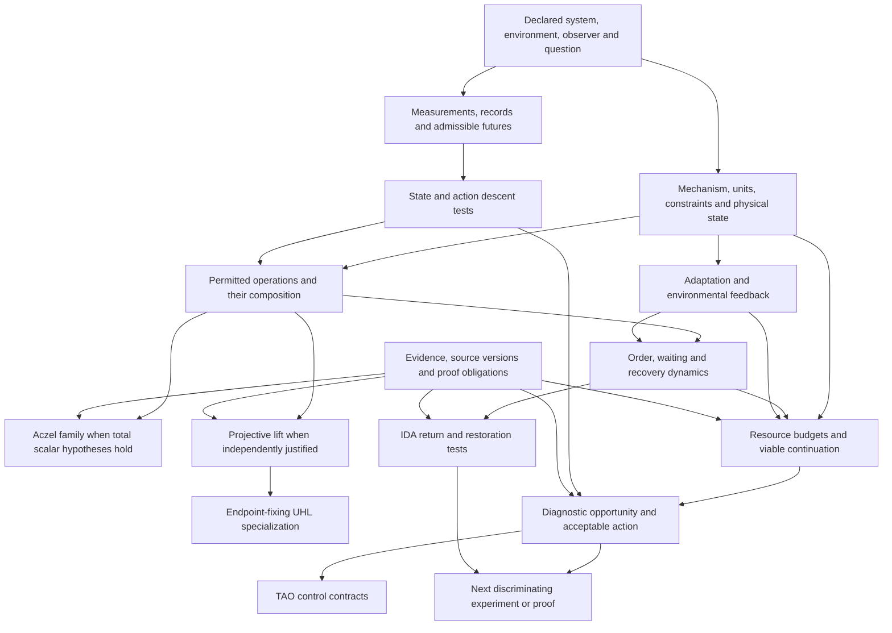

# Mathematical foundations and executable theory atlas

Version0.1.0,12 September2026. The useful common object is a **typed scientific inquiry**: a physical or mathematical system, its environment, an observer, permitted operations, constraints, a mechanism, evidence and consequences. The programme has several conditional mathematical branches. Its breadth is lost if every question is reduced to predictive-state sufficiency, or if every bounded quantity is forced into UHL.

This atlas accounts for all41 local corpus entries, substantively reviews all11 current manuscripts, preserves the existing16 rule IDs and proposes16 additional rules. Four executable certificate packages cover composition/geometry, adaptation/resources, observer/action/evidence and structural transfer. The companion `COVERAGE.md` reports the actual inspection level for each source. A registered rule, a supplied proof, a passed computation and an empirical validation remain different things.

## The dependency structure

| Layer | Foundational inputs | Consequence and gate | Programme sources |
|---|---|---|---|
| Jurisdiction | Unit/boundary, persistence, operating range, future family, experimental unit and clock | Determines what any claim means; does not establish the correct boundary | current-05/07/10; OBS-01 |
| Representation | Future laws, support/measurability, admissibility and records | Exact quotient and continuation descent; finite tolerance needs separate statistics/coverage | current-02/07/10; STATE-01/02, OBS-02 |
| Composition | Complete operations first; totality, associativity, continuity and strict monotonicity only where earned | Aczel additive generator; positive-scale freedom after identity normalization | current-06; COMP-01 |
| Projective geometry | Common-scale erasure and a linear homogeneous lift, or a separately justified projective action law | Cross-ratio preservation; endpoint fixing is an extra route to UHL | current-07/06; COMP-02/03; historical6800400/6914800 require qualifications |
| Time | Descended actions, order convention, calibrated amount/waiting, valid local expansions if used | Commutation permits counts; count compression is not amount calibration; Lie brackets need a valid small-scale window | current-10/08; TIME-01/02/03 |
| Dose and recovery | Loading direction, potential, recovery dynamics, observation/pooling law | Acute challenge and waiting can have different closure; fold passage needs specific nondegeneracy | current-03/09; REC-02/03 |
| Resources and adaptation | Stoichiometry, regeneration/supply, rate limits, time and boundary rules; explicit opposing channels | Necessary endurance bounds, model-relative viable sets, conditional benefit branches | current-05, legacy6754498/6858819/6858760; RES and ADAPT rules |
| Environment | Coupled causal maps for system and environment; joint constraints | An action can change later feasible sets; no automatic improvement or evolutionary optimality | current-05; ADAPT-01; ecology/slack domain packs |
| Action and control | Acceptable-action library, observer information, diagnostic disturbance, robust quantifier order | Static action compression, diagnostic exclusion and explicit TAO controller contracts | current-11; ACT-01/02/03; TAO-01 |
| Restoration | Frozen reference, post-withdrawal challenge, statistical margins and physical persistence | Operational IDA scores and scoped restoration tests; visible return alone is insufficient | current-02/05, IDA; REC-01, IDA-01/02 |
| Evidence | Original query, immutable inputs, trusted operators, theorem ledger, faithful rendering | Admitted results retain scope and dependencies; missing premise narrows consequences | current-01; EVID-01/02 |

This is not one mandatory linear pipeline. A biochemical balance can be useful before a minimal predictive state is identified. A declared optical transfer matrix can be composed without rederiving quantum mechanics. A finite arithmetic sieve can test exact aggregation without biological viability. The representation/state gate becomes essential when a reduced description is promoted into a law for future behavior or action.

## Branches that must remain separate

**Full operations versus reduced parameters.** Function/matrix/kernel composition is associative. Noncommuting operations retain order. A scalar parameter operation obtained after projecting away rotation, phase, records or hidden capacity may not inherit closure or associativity. A two-channel observer lift yields a general fractional-linear map; it does not make every operation an endpoint-fixing UHL translation. A one-dimensional metric has no sectional two-planes, so negative sectional curvature cannot be inferred in one dimension.

**Aczel versus mechanism.** Continuous, total, strictly monotone associative interval composition yields an additive coordinate. It does not select artanh in the observed coordinate. The certificate's h(x)=x/(1-x²) countermodel is a fully admissible bounded associative group. Drug mechanisms select different composition models; common-Hill-1 Bliss/Loewe formulas do not establish a universal pharmacological ordering across shapes, populations or mechanisms.

**Adaptation versus hormesis.** A bounded corrective controller can reduce damage without creating benefit. Current-05's sufficient theorem requires an initial net slope advantage and a later negative response; the explicit model additionally determines activation, saturation, baseline and time. A stable equilibrium calculation, an initial negative slope and a later crossing each need their own argument. The atlas checks an exact initial point; it preserves the shared interval check's unresolved status.

**Resource reserve versus redox reading.** GSH fraction, sensor oxidation, concentration, absolute amount, NADPH availability and flux are not interchangeable. The new ledger accounts for oxidized and reduced pools, cofactor regeneration and external synthesis separately. Its budget is necessary, not a complete kinetic model. Viability also depends on damage, reaction speed, admissible control and environment. An outward vector field at a declared zero floor requires an explicit stopping or boundary model.

**Physical rescue versus operational rescue.** The assertion “for every hidden state there exists a successful action” is weaker than “there exists one observation-based policy that works across the admitted hidden states/disturbances.” Diagnosis can cost time and resources or alter the state. Static action-code compression excludes the memory and complexity required to run a recursive controller.

**Records versus marginal outcomes.** Classical mixture, shared latent preparation, fresh iid preparation, conditional quantum instruments and discarded outcomes define different experiments. The quantum lead's phase-dependent reaction example uses a density matrix and product sinks; equal initial populations need not predict equal yields. The atlas only verifies a diagonal conditional filter's real probability sector and retains its success mass. Neither this identity nor a hyperbolic scattering coordinate derives quantum mechanics from boundedness.

## What the four certificates deliver

| Package | Result | Negative or narrowing case | Code versus supplied proof |
|---|---|---|---|
| `composition` | u=1/3,v=1/2 combine to5/7; x=1/4 becomes9/11; projective cross ratio4/3 | A different bounded associative group disagrees with UHL by8/9 after applying its generator | Five polynomial identities and exact instances; full-domain and analytic generator arguments supplied |
| `resources` | Delayed induction gives budget11/4 against demand3; everyT>2 excluded in toy units | External GSH source removes exclusion; printed historical zero boundary has drift-1/2 | Exact stoichiometric/response algebra; integration, comparison, branch and ODE obligations separated |
| `action_evidence` | Minimum deterministic code has2 cells;7samples needed for error<=.1; requiredtime3.5 exceeds upper horizon2 | Pairwise compatibility fails at triple; common abstain gives1; source/query/model/premise mutations rejected | Exhaustive finite cover and exact likelihood; physical diagnostic calibration not established |
| `connections` | Noncommuting projective maps preserve4/3; two recovery modes give semigroup defect1/64 | Linear/quadratic residue ranking reverses; pure-boost lemma premises fail | Exact rational examples plus supplied structural arguments; full complex classification not proved |

These are authored isolated certificates in the common inquiry envelope. `admission_adapter.py` separately applies trusted domain requirements to an actual submitted package. Its eight negative fixtures cover missing projectivity, closed-source and fixed-weight premises, a changed operation, an unknown status, a missing named proof, a changed parent resource package and changed source content. Unrelated fixture mathematics remains available. A changed operation is explicitly outside this fixture; it is not silently executed as UHL. The adapter does not infer a complete scientific dependency graph, prove that the declared dependencies are complete, or replace the coordinator's generic engine. The evidence helper also rejects erased witness dependencies after an independent review found that gap.

## Historical inheritance and domain breadth

The eleven current manuscripts govern their stated successor branches. The earlier observer, predictive-closure, equal-BED, rescue and pharmacology records are retained as provenance. Their stronger earlier claims do not gain authority through repeated citation. Later geometry papers explicitly add selectors or retain flat branches; the listed pure-boost lemma has a concrete gap requiring repair. TAO and IDA remain distinct engineering and recovery programmes with useful contracts, even though they sit in the legacy directory.

The remaining corpus provides domain tests rather than universal premises: prime-resolution/CRT calculations; ecological probability-current observation; covariance versus interventional transfer in intelligence; rare-allele identifiability; ATP-synthase demand/slack; a radius-valley negative-control result; quantum archive calibration and dependence; and evidence/estimand critiques. Their entries are all mapped in `COVERAGE.md`, including which were reviewed only at abstract/notice level. No headline from an unreplicated domain analysis becomes a mathematical axiom.

## Findings and remaining obligations

Three source-specific defects are documented in `SOURCE_FINDINGS.md`: an outward zero-boundary drift, the unjustified linear-to-quadratic residue identification, and a pure-boost selection lemma whose listed assumptions do not select the section. Existing corpus notices additionally narrow unique-artanh, exhaustive-five-flow, universal-hormesis and monotone-fold-crossover claims. These corrections leave substantial useful conditional mathematics intact.

The strongest next work is to independently review and import the source-bound packages, then connect the exact resource ledger to the biology lead's calibrated quantities and diagnostic protocol. The shared engine still needs verified dependency/source propagation and specialized finite-set, linear-balance, analytic-proof and statistical adapters; the coordinator owns those changes. The three ranked concrete research directions and nearest primary literature are in `CONNECTIONS.md`.
